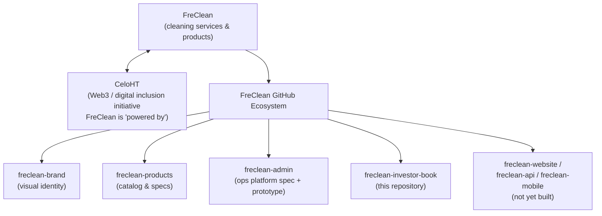

# Part I: Company

## Executive Summary

FreClean is a Haiti-based professional cleaning company building a broader ecosystem that combines cleaning services, manufactured cleaning products, entrepreneurship and franchise programs, and digital/Web3 payment infrastructure through an affiliated initiative called CeloHT. **(Confirmed**: as published by FreClean.)

This book presents FreClean as it actually stands today: a company with a clearly articulated mission, vision, and business model, an in-progress brand and documentation foundation, and a substantial set of operational, financial, and product gaps still to be closed before it can be evaluated the way a mature operating company would be. Part XVII of this book, *What Still Needs to Be Proven*, consolidates those gaps in one place rather than scattering them for a reader to discover chapter by chapter.

## What Is FreClean?

FreClean describes itself as building "the future of cleaning through innovation and technology," combining four connected pillars: professional cleaning services, manufactured cleaning products, entrepreneurship/franchise enablement, and digital payments. **(Confirmed.)**

## Origin and Story

The name **FreClean** combines two roots: "Fre," derived from "Freda," and "Clean," derived from the Haitian Creole word "Pwòp," meaning clean at every level, conscious and economic. **(Confirmed, provided directly by FreClean**; this is among the first formal publications of this etymology.) Beyond the name's origin, no founder narrative, company history, or founding date has been published. **(Not Publicly Disclosed.)**

## Mission

> "Our mission is to provide reliable, affordable, and environmentally responsible cleaning products and professional services while empowering individuals through entrepreneurship, education, innovation, and digital financial inclusion. We strive to improve everyday living by delivering exceptional quality, creating sustainable employment opportunities, and supporting local economic development." **(Confirmed.)**

## Vision

> "Our vision is to become one of the Caribbean's most trusted and innovative cleaning brands, recognized internationally for excellence, sustainability, customer satisfaction, and technological innovation." **(Confirmed.)**

## Values

FreClean states twelve core values: Excellence, Integrity, Professionalism, Innovation, Sustainability, Transparency, Accountability, Customer Satisfaction, Community Development, Environmental Responsibility, Continuous Improvement, and Collaboration. **(Confirmed.)**

## Company Positioning

FreClean positions itself at the intersection of three things that are not usually combined by a single early-stage company: a consumer cleaning products/services brand, an entrepreneurship and franchise platform, and a Web3-enabled payments strategy through the CeloHT relationship. This combination is a genuine point of differentiation *if executed*, and a genuine point of complexity risk if any one pillar is under-resourced relative to the others: a tension explored further in Part XVI, *Risk*.

## Business Overview

FreClean is based in Haiti and states an intention to expand into the Dominican Republic and the wider Caribbean, and eventually into international markets. **(Confirmed** intention; **TBD** timeline.) It operates, or intends to operate, across residential, commercial, and specialized cleaning services; a manufactured product line spanning seven categories; wholesale and white/private-label manufacturing; and franchise and entrepreneurship programs. Each of these is examined in its own part of this book, with the current evidence for it stated plainly rather than assumed.

## The FreClean GitHub Ecosystem

FreClean's public documentation and technical assets are organized as a set of GitHub repositories, each with a distinct purpose:

*(Diagram source: [`../../diagrams/organization/ecosystem-structure.mmd`](../../diagrams/organization/ecosystem-structure.mmd); rendered version: [`ecosystem-structure.svg`](../../diagrams/organization/ecosystem-structure.svg).)*

This investor book is intentionally self-contained: every fact about FreClean it relies on is restated directly in its own chapters, so it can be read, shared, and evaluated as a standalone publication.

## Continuing

Part II examines the market problem FreClean says it addresses and the opportunity it is pursuing.
