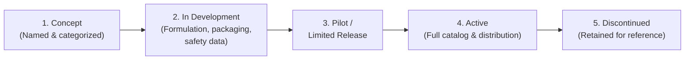

# Part III: Products

## Status Overview

FreClean has published a product portfolio spanning **7 categories and 18 named products**. **(Confirmed** for names and categories.) No product currently has a confirmed price, package size, ingredient list, safety data sheet, or manufacturing status. **(TBD** for all of the above, every product.) This chapter presents every product with its actual, current status: none are described as more advanced than they are.

## The Product Catalog

| Category | Products |
|---|---|
| Personal Care | Liquid Hand Soap, Hand Sanitizer |
| Kitchen | Dishwashing Liquid, Degreaser |
| Laundry | Laundry Detergent, Fabric Softener, Stain Remover |
| Floor Care | Floor Cleaner, Floor Polish |
| Bathroom | Bathroom Cleaner, Toilet Cleaner, Mold Remover |
| Glass Care | Glass Cleaner, Mirror Cleaner |
| Multi-Purpose | Multi-Purpose Cleaner, Surface Disinfectant, Air Freshener, Industrial Cleaner |

For each product, the **name** and **category** are confirmed. The **purpose** is inferable from the name (a "Glass Cleaner" cleans glass, for instance), though no separate published positioning copy exists per product. The **target customer** is addressed in Part V. **Format, usage, and differentiation** are TBD for all 18 products, since no packaging, dilution, or formulation information has been published (see Part X). The **current status** cannot be confirmed which of the 18 are currently manufactured and sold versus still in development; FreClean has not published that distinction. **(TBD.)**

## Existing vs. Planned vs. Concept

Applying this book's verification-status discipline strictly:

- **Existing (Confirmed as currently sold):** None: no product has been confirmed as currently available for purchase.
- **Planned (named, category-assigned, not yet confirmed as sold):** All 18 products above.
- **Concept (visual/illustrative only, not a real manufactured item):** All product imagery referenced anywhere in FreClean's public materials, including the concept bottle mockups referenced in this book's [`assets/products/`](../../assets/products/) folder, each labeled **CONCEPT VISUAL: NOT FINAL PRODUCT PHOTOGRAPHY**.

This is a stricter classification than FreClean's own public materials apply: FreClean's published lists do not themselves distinguish existing from planned. This book applies the stricter standard rather than assume any product is further along than confirmed.

## Product Development Lifecycle

*(Diagram source: [`../../diagrams/product-lifecycle/product-development-lifecycle.mmd`](../../diagrams/product-lifecycle/product-development-lifecycle.mmd).)*

All 18 FreClean products are, at minimum, at Stage 1 (Concept) of this lifecycle: they are named and categorized. None has published evidence of reaching Stage 3 or beyond.

## White-Label and Private-Label Manufacturing

FreClean's business model includes white-label and private-label manufacturing as a distinct revenue stream (see Part VI). **(Confirmed** as a stated business line; **TBD** for any client, minimum order quantity, or lead-time terms.)

## Differentiation

FreClean's most defensible differentiation at the product level is not, at least not yet, formulation or packaging, since none is public. It is positioning: a Haiti-rooted, Caribbean-focused cleaning brand with an explicit entrepreneurship and digital-payments angle that most multinational cleaning brands do not offer. Whether this positioning converts into a defensible product advantage depends on execution not yet visible in public materials (see Part IX, *Competitive Landscape*, and Part XVII).

## Continuing

Part IV turns to FreClean's cleaning services, which, unlike the product line, include specific, named service categories already described in detail by FreClean.
