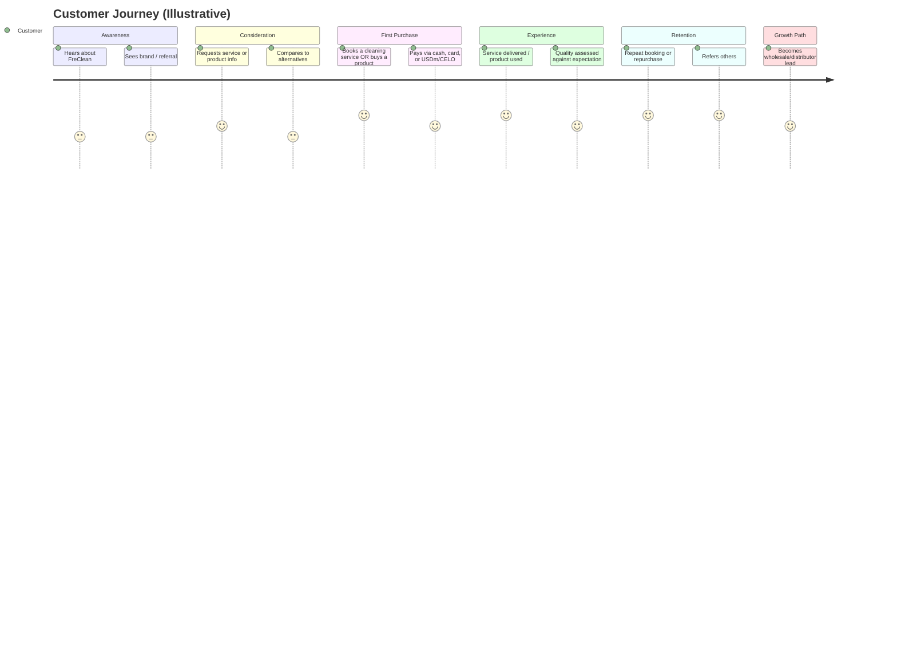

# Part V: Customers

## Stated Target Segments

FreClean names twelve target market segments: Homes, Apartments, Airbnb Hosts, Hotels & Resorts, Restaurants, Offices, Schools & Universities, Hospitals & Clinics, Government Institutions, NGOs, Retail Businesses, and Industrial Facilities. **(Confirmed** as published; **TBD** for which segments are currently served versus long-term aspirational.)

## Segment Analysis

| Segment | Purchasing logic (Assumption, industry-typical) | Likely near-term priority |
|---|---|---|
| Consumer households | Price-sensitive, trust- and word-of-mouth-driven, recurring low-ticket purchases | High, lowest barrier to entry |
| Airbnb/property operators | Reliability and turnaround-time driven, recurring bookings tied to guest calendars | High, natural fit for a service-first go-to-market |
| Hotels & hospitality | Contract-based, quality-and-consistency driven, larger recurring ticket size | Medium, requires proven service capacity first |
| Institutions (schools, hospitals, government, NGOs) | Procurement-process driven, often requires formal bidding, certifications, and compliance documentation | Low near-term, Part IX and Part XVI both flag institutional sales as requiring capabilities (certifications, formal SLAs) not yet confirmed to exist |
| Distributors / entrepreneurs | Margin- and support-driven; want a credible brand and reliable supply, not a one-off purchase | Medium, tied directly to Part X (Operations) manufacturing maturity |

This segmentation is this book's own analytical framework, not a FreClean-published prioritization: FreClean has not stated which of its twelve segments it is pursuing first (see Part II).

## Customer Journey (Illustrative)

*(Diagram source: [`../../diagrams/customer-flow/customer-journey.mmd`](../../diagrams/customer-flow/customer-journey.mmd). Labeled Illustrative because it models a plausible journey, not a measured one: no FreClean customer funnel data has been published.)*

## Distributors and Entrepreneurs as a Distinct Customer Type

FreClean's business model treats distributors, wholesalers, and franchisees not just as a sales channel but as a customer type in their own right; see Part VI and Part X, *Franchise*, in the accompanying business documentation. **(Confirmed** as a stated business line; **TBD** for actual signed distributors or franchisees, none of which is confirmed.)

## What Is Not Yet Known

- No customer count, retention rate, or repeat-purchase rate has been published. **(TBD.)**
- No customer satisfaction data or testimonials have been published: and none are used anywhere in this book, consistent with the instruction not to fabricate testimonials. **(Not Publicly Disclosed.)**
- No segment-level revenue breakdown exists. **(TBD.)**

## Continuing

Part VI turns to the business model that connects these customer segments to FreClean's revenue streams.
