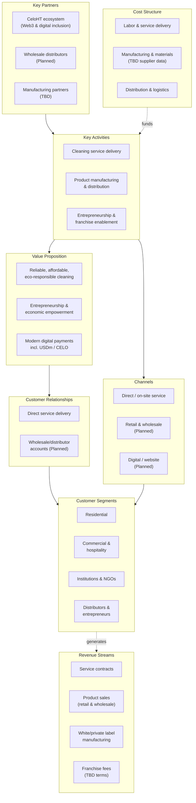

# Part VI: Business Model

## Value Proposition

For customers: reliable, affordable, environmentally responsible cleaning delivered by a locally rooted brand. For entrepreneurs and distributors: a route into the cleaning business via training, wholesale access, and franchise support. For the broader ecosystem: a Web3-enabled payment option (USDm/CELO) not commonly offered by cleaning businesses. **(Confirmed** as FreClean's stated value proposition.)

## Revenue Streams

FreClean states eleven distinct revenue lines: Professional Cleaning Services (residential, commercial, industrial), Product Manufacturing, Wholesale Distribution, Retail Sales, White-Label Manufacturing, Private Label Production, Franchise Opportunities, Business Consulting, Corporate Partnerships, and Training Programs. **(Confirmed** as stated; **TBD** for the relative revenue contribution of each, none of which has been disclosed.)

## Cost Structure

**(TBD for all figures.)** The structural cost categories a company with this business model would be expected to carry are: direct labor for service delivery; manufacturing and raw materials; packaging; distribution and logistics; brand/marketing; and platform/technology costs (see the companion `freclean-admin` specification for the internal operations platform this would eventually require). No specific cost figures have been published for any of these categories.

## Distribution Model

Direct sales, retail, wholesale, and (planned) online/e-commerce channels. **(Confirmed** as stated; **TBD** for which are currently active; see Part XIII.)

## Customer Acquisition

No customer acquisition channel, cost, or conversion data has been published. **(TBD.)** The most plausible acquisition channels, based on the business as described, are local word-of-mouth/referral (typical for a residential cleaning service) and the CeloHT ecosystem relationship (Part XI), which may provide a built-in early audience. **(Assumption.)**

## Retention

No retention or repeat-purchase data exists. **(TBD.)** Structurally, cleaning is a recurring-need category, which supports a subscription/repeat-service model in principle: but this is a category-level observation, not evidence of FreClean's actual retention.

## Partnerships

FreClean states it welcomes partnerships with businesses, hotels, restaurants, retail stores, government agencies, NGOs, educational institutions, environmental organizations, community associations, international organizations, technology companies, and distribution partners. **(Confirmed** as an open invitation; **Not Yet Verified** for any specific named partnership beyond the CeloHT relationship, which is itself **Confirmed** as stated but **Not Yet Verified** in its specific legal/contractual form.)

## Scalability

The services business scales primarily with labor and local operational capacity: inherently harder to scale rapidly than a pure digital product. The products business scales with manufacturing capacity and distribution reach: currently unconfirmed (Part X). The franchise model, if executed, is the most naturally scalable revenue line, since it transfers execution to franchisees rather than requiring FreClean to directly staff every new market. **(Analytical framework: this book's own assessment, not a FreClean-published scalability claim.)**

## Business Model Canvas

*(Diagram source: [`../../diagrams/business-model/business-model-canvas.mmd`](../../diagrams/business-model/business-model-canvas.mmd).)*

## Continuing

Part VII shows how products and services are designed to reinforce each other within this model.
