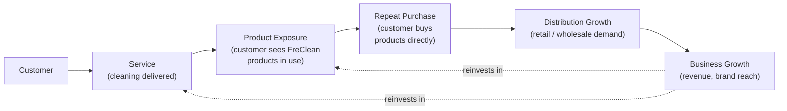

# Part VII: Products + Services Ecosystem

## The Reinforcement Loop

FreClean's services and products are designed to function as a single reinforcing system rather than two separate businesses. A customer's first contact is most plausibly a **service** (Part IV): a booked cleaning visit requires less trust than a first-time product purchase from an unfamiliar brand. During that service, FreClean-branded **products** (Part III) are used in front of the customer, creating direct product exposure without a separate marketing spend. A satisfied customer is then positioned to become a **repeat product buyer**, purchasing FreClean products directly for use between service visits. Aggregate product demand, from consumers and eventually from institutional and wholesale customers, supports **distribution growth** (Part XIII), which in turn funds **business growth**, some of which can be reinvested in expanding both service capacity and product manufacturing.

*(Diagram source: [`../../diagrams/ecosystem/product-service-ecosystem.mmd`](../../diagrams/ecosystem/product-service-ecosystem.mmd). This loop is this book's own analytical model of how FreClean's stated business lines could reinforce each other: it is a structural framework, not a measured or confirmed customer flow.)*

## Why This Matters for an Investor

This loop is the strongest structural argument for why FreClean's two-sided model (services + products) could out-perform either half alone: service delivery solves the product line's "unknown brand" cold-start problem, and the product line solves the service business's structurally lower per-customer margin and scalability ceiling. The loop is currently **theoretical**: no data confirms that FreClean customers who receive a service subsequently purchase products, because no such tracking or reporting has been published. **(TBD.)**

## What Would Validate This Loop

Three simple, low-cost signals would materially strengthen this thesis if FreClean's team can produce them:
1. The percentage of service customers who go on to make at least one direct product purchase within, say, 90 days.
2. Repeat-service booking rate.
3. Any distributor or wholesale lead that originated from a service customer or their referral, rather than from cold outreach.

None of these three data points currently exist in FreClean's public materials. Flagging exactly what would validate the model, rather than asserting the model is already proven, is intentional here and throughout this book (see Part XVII).

## Continuing

Part VIII turns outward, to the size and shape of the market this ecosystem is competing in.
