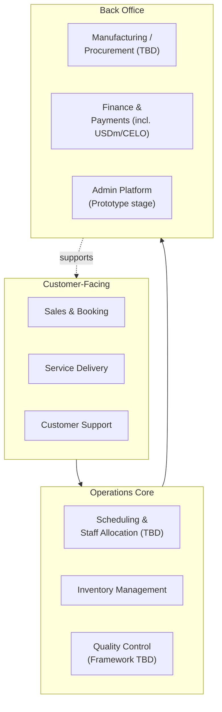

# Part X: Operations

## Overview

This chapter separates what FreClean has confirmed operationally from what remains to be built: the single largest gap category in this entire book.

## Manufacturing

**(TBD / Not Yet Verified.)** No manufacturing facility, location, ownership model (in-house vs. contract manufacturer), or production capacity has been confirmed for any FreClean product.

## Procurement

**(TBD.)** No raw material suppliers, sourcing regions, or procurement process have been published.

## Inventory

**(TBD.)** No warehouse location(s), inventory management system, or current stock data exist. A specification for an inventory-tracking module exists in the companion `freclean-admin` repository, but it is a design specification and UI prototype using fictional sample data, not an operating system.

## Packaging

**(Concept stage.)** No container specifications, label designs, or size variants have been confirmed for any product. Concept-stage visual mockups exist (see [`../../assets/products/`](../../assets/products/)), clearly labeled as concepts, not packaging design deliverables.

## Quality Control

FreClean states that services follow "strict quality-control procedures," but no specific checklist, inspection cadence, or documented process has been published. **(TBD** for specifics; **Confirmed** only as a general stated intention.)

## Distribution & Logistics

FreClean states an intention to distribute through direct sales, retail, and wholesale channels, expanding geographically from Haiti into the Dominican Republic and the wider Caribbean. **(Confirmed** intention; **TBD** for any active channel, carrier, or logistics partner.)

## Customer Service

**(TBD.)** No dedicated customer service channel, SLA, or support process has been published beyond a general contact email.

## Technology

See Part XI for a full treatment. In summary: a UI specification and prototype exists for an internal admin platform (customers, orders, inventory, reporting); no backend, database, or live system exists yet.

## Administration

**(TBD.)** No confirmed organizational structure, headcount, or role assignments exist publicly (see Part V of the `freclean-admin` specification for a *proposed*, not confirmed, role structure).

## Operating Model

*(Diagram source: [`../../diagrams/operating-model/operating-model.mmd`](../../diagrams/operating-model/operating-model.mmd). This is a proposed target-state model, not a description of a system that currently exists in full.)*

## Why This Chapter Matters Most

Of every part of this book, Operations is where the gap between FreClean's stated ambition (Part I, Part VI) and its currently demonstrable capability (this chapter) is widest. An investor evaluating FreClean should weight this chapter, together with Part XVII, more heavily than the brand and narrative strength documented elsewhere in this book.

## Continuing

Part XI examines the technology layer specifically, including the role, and the limits, of FreClean's Web3/CeloHT relationship.
