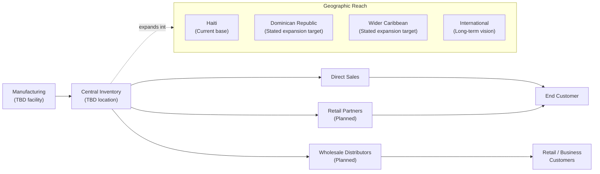
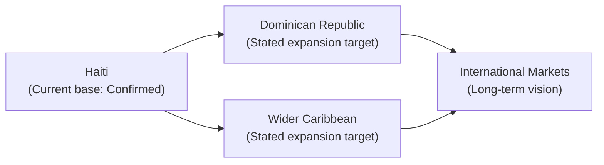

# Part XIII: Distribution & Expansion

## Current Channels

FreClean states four channel types: direct sales, retail, wholesale, and (implicitly, through its website) online/digital. **(Confirmed** as stated intentions; **TBD** for which are currently active.)

## Distribution Network (Framework)

*(Diagram source: [`../../diagrams/distribution/distribution-network.mmd`](../../diagrams/distribution/distribution-network.mmd). This is a target-state framework built from FreClean's stated intentions, not a description of a network that currently exists in full: nodes marked TBD/Planned have not been confirmed as operating.)*

## Partnerships and Franchise

FreClean states it welcomes distributors, wholesalers, retailers, and strategic business partners, and separately offers a franchise/entrepreneurship program including business training, wholesale opportunities, branding support, and franchise development. **(Confirmed** as stated; **TBD** for any signed distributor, wholesaler, or franchisee: none is confirmed.)

## White-Label and Private-Label Opportunities

Included in FreClean's stated business model (Part VI) as manufacturing services offered to third parties. **(Confirmed** as a stated offering; **TBD** for terms, minimums, or any client.)

## Geographic Expansion Strategy

*(Diagram source: [`../../diagrams/geographic-expansion/geographic-expansion.mmd`](../../diagrams/geographic-expansion/geographic-expansion.mmd).)*

FreClean's stated roadmap places Caribbean-wide expansion in "Phase 3" of its published roadmap, after brand establishment, initial service/product launch, and distribution/partnership strengthening in Phases 1 and 2; see Part XVIII for the full roadmap. **(Confirmed** as stated sequencing; **TBD** for dates, which FreClean has not published for any phase.)

## The Diaspora Distribution Angle

As discussed in Part VIII, Haiti's diaspora represents a large, distinct capital flow (~USD 3.8–4.1 billion annually, third-party sourced). A distribution or marketing strategy explicitly targeting diaspora communities abroad, for example by enabling diaspora members to purchase FreClean services or products for family members in Haiti, potentially through the USDm/CELO payment rails already part of FreClean's stated strategy (Part XI), would be a logical extension of FreClean's current positioning. **(This is this book's own strategic observation, not a FreClean-published plan, and is flagged as such.)**

## Continuing

Part XIV turns to the financial framework underlying all of the above: and is explicit about what is real data versus illustrative modeling.
