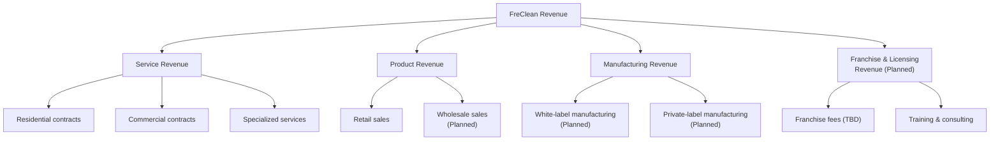

# Part XIV: Financial Framework

## What This Chapter Is and Is Not

FreClean has not published revenue figures, cost data, margins, or any other financial performance metric. **(TBD / Not Yet Verified. No financial statements, management accounts, or investor financial data were available to this book.)** This chapter therefore does two things only: it lays out the **revenue model structure** (which is confirmed, as a statement of intent), and it builds **clearly labeled Illustrative Scenarios**, worked examples using stated assumptions, to show how a reader could reason about FreClean's unit economics once real data is available. No number in the "Illustrative Scenario" sections below should be read as an actual FreClean figure.

## Revenue Model

*(Diagram source: [`../../diagrams/revenue-model/revenue-model.mmd`](../../diagrams/revenue-model/revenue-model.mmd).)*

## Cost Structure Framework

| Category | Nature | Status |
|---|---|---|
| Direct labor (service delivery) | Variable, scales with bookings | Structure confirmed; figures TBD |
| Manufacturing & raw materials | Variable, scales with product volume | TBD, no supplier or cost data published |
| Packaging | Variable | Concept stage only (Part X) |
| Distribution & logistics | Variable/semi-fixed | TBD |
| Brand & marketing | Largely fixed/discretionary | TBD |
| Technology/platform | Fixed, front-loaded | Specification exists (`freclean-admin`); no build cost incurred yet |

## Unit Economics Framework: Illustrative Scenario

**Illustrative Scenario: not actual FreClean data.** The table below demonstrates *how* to think about a single residential service booking's unit economics, using round, clearly hypothetical numbers chosen only to make the framework legible:

| Line item | Illustrative value | Note |
|---|---|---|
| Service price per booking | $40 (Illustrative) | No real FreClean price has been published |
| Direct labor cost | $18 (Illustrative, ~45% of price) | Typical labor-intensive service ratio, not FreClean-specific |
| Materials/consumables cost | $4 (Illustrative, ~10% of price) | |
| Gross margin per booking | $18 (Illustrative, ~45%) | |
| Illustrative customer acquisition cost (CAC) | $15 (Illustrative) | Assumes local/referral-driven acquisition, not paid digital ads |
| Bookings to recover CAC | ~1 (Illustrative) | Only meaningful if repeat-booking rate is high, unconfirmed |

## Gross Margin Framework

For the **product line**, gross margin depends on manufacturing cost per unit versus retail/wholesale price: neither of which is published (Part III, Part X). For **services**, gross margin depends primarily on labor cost as a share of the service price. Both require real data FreClean has not yet disclosed to move from framework to forecast.

## Customer Lifetime Value (LTV) Framework: Illustrative Scenario

**Illustrative Scenario.** If a residential customer books quarterly at an illustrative $40/booking with a 45% illustrative gross margin, and remains a customer for an illustrative 2 years (8 bookings), illustrative gross-margin LTV would be approximately **$144** (8 × $40 × 0.45). This is presented purely to show the calculation method; every input is hypothetical.

## Break-Even Framework

A break-even analysis requires fixed cost data (facility, core staff, platform costs) that FreClean has not published. **(TBD.)** Structurally, a services-led early revenue strategy (Part IV, Part VII) reaches operational break-even faster than a manufacturing-led strategy, because it avoids large upfront inventory and production capital: a general business-model observation, not a FreClean-specific projection.

## Scenario Analysis: Illustrative

| Scenario | Illustrative assumption | Directional implication |
|---|---|---|
| Conservative | Slow customer acquisition, services-only revenue for 12+ months | Lower near-term capital need; slower ecosystem-loop validation (Part VII) |
| Base | Services scale first; product line launches within Year 1 with limited SKUs | Matches FreClean's stated Phase 1 roadmap (Part XVIII) |
| Accelerated | Rapid franchise/wholesale signing alongside service and product scaling | Requires more upfront capital (Part XV) and carries more execution risk (Part XVI) |

## Continuing

Part XV turns to the funding required to move from this framework to real financial performance.
