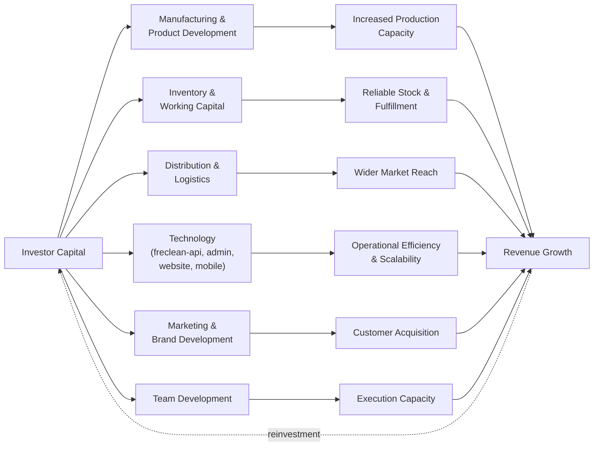

# Part XV: Funding

## No Official Funding Target Exists

FreClean has not published a specific capital-raise target, valuation, or funding round structure. **(TBD / Not Publicly Disclosed.)** This chapter therefore presents a **capital deployment framework**, showing where capital would logically go and roughly why, rather than inventing a target number FreClean has not set.

## Capital Deployment Framework

*(Diagram source: [`../../diagrams/capital-flow/investor-capital-flow.mmd`](../../diagrams/capital-flow/investor-capital-flow.mmd).)*

## Deployment Categories, in Priority Order

Based on the gap analysis across Parts III, X, and XI, capital would most productively address gaps in roughly this order:

1. **Manufacturing**: moving the 18-product catalog (Part III) from "named and categorized" to "in development," including real formulation and Safety Data Sheets. Without this, the product-revenue line (Part VI) cannot begin.
2. **Working capital / inventory**: once manufacturing exists, initial inventory is required to fulfill orders reliably.
3. **Technology**: building `freclean-api` and a production version of the `freclean-admin` platform, moving past the current specification-and-prototype stage (Part XI).
4. **Distribution**: establishing the first confirmed retail or wholesale channel (Part XIII).
5. **Marketing/brand activation**: FreClean's brand foundation is strong (Part XII); capital here would activate it rather than build it from scratch.
6. **Team**: formalizing roles beyond what is currently proposed (not confirmed) in the `freclean-admin` specification.

This ordering is this book's own analysis based on which gaps block which downstream revenue lines: it is not a FreClean-published capital allocation plan.

## Working Capital Considerations

A manufacturing- and inventory-dependent business model (Part VI) is more working-capital-intensive than a pure services business. Any funding conversation should distinguish between capital that builds *capability* (manufacturing setup, technology) and capital that funds *ongoing working capital* (inventory turns, payroll between invoice cycles): the former is a one-time investment, the latter recurs and should be sized against confirmed unit economics (Part XIV), which do not yet exist.

## What FreClean Would Need to Provide to Make This Concrete

For any investor conversation to move from this framework to an actual funding ask, FreClean's team would need to supply: a specific near-term service-area and product-launch plan (Part IV, Part III), at least directional cost data for manufacturing setup, and a specific team/hiring plan. None of these currently exist in public materials.

## Continuing

Part XVI turns to a full risk analysis, including the operational and financial gaps this chapter and Part XIV have already surfaced.
