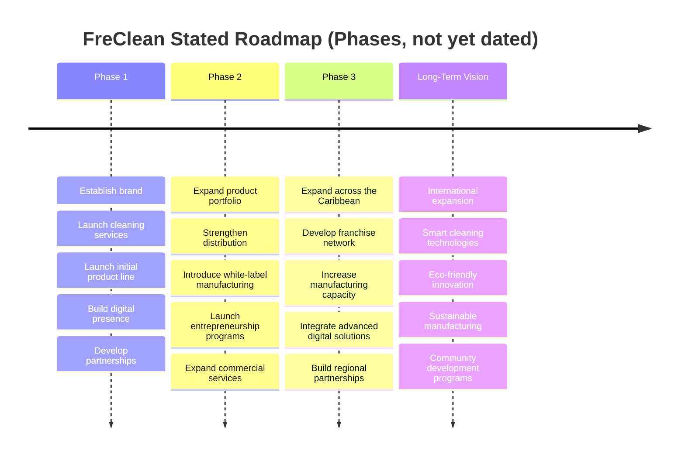

# Part XVIII: Growth Strategy

## FreClean's Stated Roadmap

FreClean has published a phased roadmap. No dates are attached to any phase: this book does not add invented ones.

*(Diagram source: [`../../diagrams/growth-strategy/growth-strategy-timeline.mmd`](../../diagrams/growth-strategy/growth-strategy-timeline.mmd).)*

## 12-Month Priorities (This Book's Recommendation, Not a FreClean Commitment)

Based on the gap analysis in Part XVII, the highest-leverage 12-month priorities would be:
1. Confirm and formally state the current operating status and service area (Part IV).
2. Move at least 2–3 products from "Concept" to "In Development," including real SDS/safety data (Part III, Part X).
3. Establish basic financial reporting sufficient to replace Part XIV's illustrative framework with real numbers.
4. Formalize the KYC/AML and refund posture for USDm/CELO payments before scaling that channel (Part XI).

## 3-Year Growth Strategy

Consistent with FreClean's own Phase 1 through 3 sequencing, the order runs: establish and validate the Haiti service and initial product business first, strengthen distribution and introduce manufacturing-dependent revenue lines like white-label production second, then pursue Caribbean-wide geographic and franchise expansion third. That is the order this book recommends, not a parallel push, given the operational gaps documented in Part X and Part XVII.

## Geographic Expansion

Sequenced behind Haiti validation per FreClean's own stated roadmap: Dominican Republic and wider Caribbean next, international markets as a long-term vision (Part XIII).

## Product Expansion

FreClean's 18-product catalog (Part III) already exceeds what most early-stage companies would attempt to launch simultaneously. A disciplined growth strategy would launch a small subset first (illustratively, 2–4 highest-demand categories such as Multi-Purpose and Kitchen), validate manufacturing and demand, then expand the remaining categories: rather than attempting all 18 at once. **(This book's recommendation, not a FreClean-published sequencing.)**

## Distribution Expansion

Direct/service-based sales first (lowest capital requirement), then retail, then wholesale/franchise once manufacturing and quality-control capability (Part X) are demonstrated: consistent with the capital deployment ordering in Part XV.

## Digital Expansion

A functioning website with real booking/e-commerce capability, followed by the production build of the `freclean-admin` platform and a `freclean-api` backend (Part XI), are reasonable digital-expansion priorities once core service/product operations are validated: digital infrastructure amplifies an already-working business model more effectively than it substitutes for one.

## Partnership Strategy

Prioritize partnerships that close specific gaps identified in Part XVII (e.g., a manufacturing partner, a distribution partner) over partnerships that primarily add brand association without closing an operational gap.

## Long-Term Vision

FreClean's own stated long-term vision, spanning international expansion, smart cleaning technologies, eco-friendly innovation, sustainable manufacturing, and community development programs, is ambitious but directionally coherent with the brand and mission established in Part I and Part XII. Its credibility depends entirely on closing the gaps in Part XVII first.

## Continuing

Part XIX presents the investment thesis this entire book has been building toward: including what must happen for it to succeed, and what could invalidate it.
