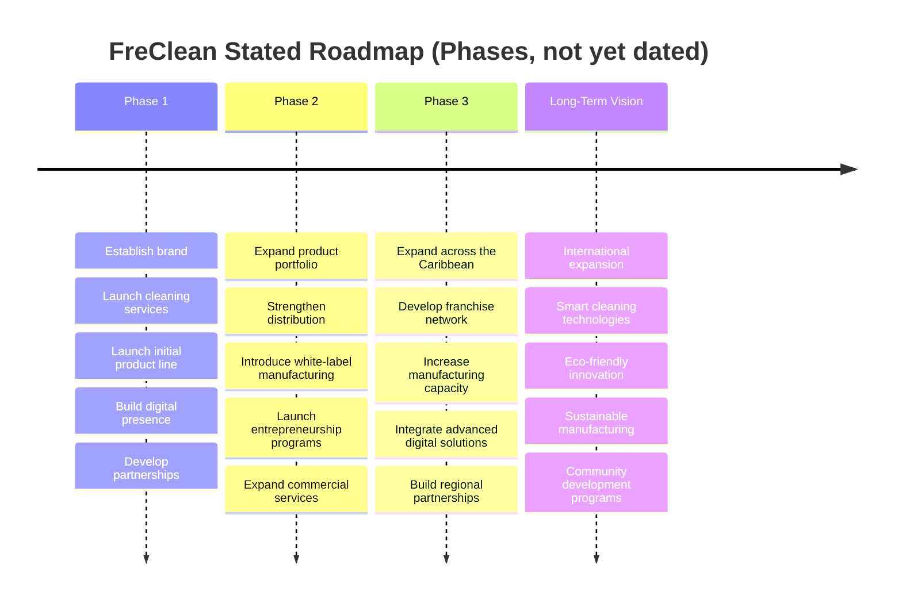

# Roadmap

FreClean's stated phased roadmap, as published. No dates are attached to any phase: none are invented here. See [`GROWTH_STRATEGY.md`](GROWTH_STRATEGY.md) for this book's recommended near-term priorities layered on top of this roadmap, and [`book/chapters/18-growth-strategy.md`](book/chapters/18-growth-strategy.md) for the version with the embedded timeline diagram.

## Current Phase

**Status: TBD.** FreClean has not stated which phase it currently considers itself to be in. Given the operational gaps documented in [`book/chapters/17-what-still-needs-to-be-proven.md`](book/chapters/17-what-still-needs-to-be-proven.md), this book's assessment is that FreClean is early within, or has not yet fully completed, Phase 1: but this is an inference from available evidence, not a FreClean-confirmed status.
